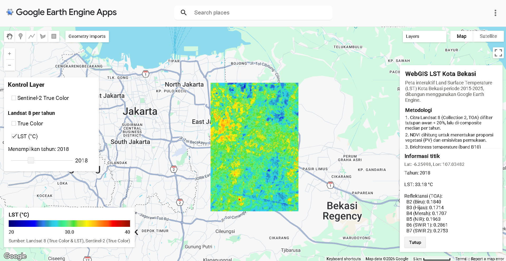

# WebGIS LST Kota Bekasi (2015–2025)

WebGIS interaktif untuk memantau dan menganalisis Land Surface Temperature (LST) Kota Bekasi dari tahun 2015 hingga 2025, dibangun menggunakan Google Earth Engine (GEE) JavaScript API.

## Deskripsi

Proyek ini menghitung dan memvisualisasikan suhu permukaan (Land Surface Temperature) Kota Bekasi menggunakan citra satelit Landsat 8, dilengkapi dengan citra true color Landsat 8 dan Sentinel-2 sebagai pembanding visual. Peta bersifat interaktif — pengguna dapat mengganti tahun tampilan, menyalakan/mematikan layer, melihat statistik area, serta mengklik lokasi tertentu di peta untuk melihat data suhu dan reflektansi secara detail.

## Link Akses
[text](https://windy-nation-484911-g8.projects.earthengine.app/view/webgis-lst-kota-bekasi)

## Fitur utama

### 1. Layer LST per tahun (2015–2025)
Land Surface Temperature dihitung untuk setiap tahun dari citra Landsat 8, ditampilkan dengan skema warna gradien (biru = suhu rendah, merah = suhu tinggi).

### 2. Layer True Color
- **Landsat 8 True Color** — komposit RGB (B4, B3, B2) per tahun, mengikuti tahun yang sama dengan LST.
- **Sentinel-2 True Color** — citra resolusi lebih tinggi sebagai referensi visual tambahan.

### 3. Slider tahun
Menggeser slider akan otomatis mengganti tampilan layer True Color dan LST ke tahun yang dipilih, tanpa perlu menjalankan ulang skrip.

### 4. Panel kontrol layer
Checkbox untuk menyalakan/mematikan setiap jenis layer secara independen:
- Sentinel-2 True Color
- Landsat 8 True Color
- Landsat 8 LST

### 5. Legenda LST
Legenda dengan gradien warna kontinu beserta label suhu minimum, tengah, dan maksimum (skala 20°C–40°C), termasuk keterangan sumber citra yang digunakan.

### 6. Panel informasi proyek
Panel di sisi kanan peta yang menjelaskan tujuan proyek, ringkasan metodologi perhitungan LST, sumber data, serta statistik suhu (minimum, maksimum, rata-rata) yang otomatis diperbarui sesuai tahun yang aktif di slider.

### 7. Informasi klik peta
Mengklik titik mana pun di peta akan menampilkan panel informasi berisi:
- Koordinat lokasi (lintang, bujur)
- Nilai LST (°C) pada titik tersebut
- Nilai reflektansi TOA untuk band B2 (biru), B3 (hijau), B4 (merah), B5 (NIR), B6 (SWIR 1), dan B7 (SWIR 2)
- Tahun data mengikuti posisi slider yang sedang aktif

### 8. Grafik tren
Grafik time series brightness temperature (band B10) Kota Bekasi dari tahun 2015 sampai 2025, menampilkan pola kecenderungan suhu dari waktu ke waktu.

## Metodologi perhitungan LST

1. Citra Landsat 8 Collection 2 (T1_TOA) difilter berdasarkan wilayah kajian (`geometry`) dan tutupan awan di bawah 20%, lalu di-composite menggunakan median per tahun.
2. Piksel awan, bayangan awan, dan sirus dimasking menggunakan band `QA_PIXEL`.
3. NDVI dihitung dari band NIR (B5) dan Merah (B4) untuk menentukan proporsi vegetasi (PV).
4. Emisivitas permukaan diestimasi dari nilai PV.
5. Brightness temperature diambil dari band termal (B10), kemudian dikoreksi menggunakan emisivitas untuk menghasilkan nilai LST dalam derajat Celsius.

## Sumber data

| Sumber | Kegunaan | Resolusi |
|---|---|---|
| Landsat 8 Collection 2 (T1_TOA) | True Color, perhitungan LST | 30 m (termal diresampel dari 100 m) |
| Sentinel-2 SR Harmonized | True Color referensi | 10 m |

## Struktur kode

```
├── Fungsi masking awan
│   ├── maskL8sr()      → masking awan Landsat 8 (QA_PIXEL)
│   └── maskS2clouds()  → masking awan Sentinel-2 (QA60)
├── Fungsi pengolahan citra
│   ├── ambilCitraTahun(tahun)  → composite median Landsat per tahun
│   └── hitungLST(dataset)      → NDVI → emisivitas → LST
├── Layer peta
│   ├── l8TrueColorLayers{tahun} → True Color per tahun (2015-2025)
│   ├── lstLayers{tahun}         → LST per tahun (2015-2025)
│   └── sentinelLayer            → Sentinel-2 True Color
├── UI Panel
│   ├── controlPanel     → checkbox layer + slider tahun (top-left)
│   ├── legend           → gradien warna LST (bottom-left)
│   ├── infoPanel        → deskripsi proyek + statistik (top-right)
│   └── clickInfoPanel   → hasil klik peta (bottom-right)
└── Grafik
    └── ui.Chart.image.series → tren brightness temperature 2015-2025
```

## Cara penggunaan

1. Buka skrip di [Google Earth Engine Code Editor](https://code.earthengine.google.com/).
2. Pastikan variabel `geometry` sudah diatur ke batas wilayah Kota Bekasi (import sebagai asset atau gambar manual di peta).
3. Klik **Run**.
4. Gunakan slider di panel kiri atas untuk memilih tahun (2015–2025).
5. Gunakan checkbox untuk menampilkan/menyembunyikan layer sesuai kebutuhan.
6. Klik lokasi mana pun di peta untuk melihat detail LST dan reflektansi pada titik tersebut.
7. Lihat grafik tren brightness temperature di panel Console.

## Visualisasi 


Tampilan di atas menunjukkan layer LST tahun 2018, lengkap dengan panel kontrol layer (kiri atas), legenda gradien suhu (kiri bawah), panel informasi proyek (kanan atas), dan panel hasil klik peta yang menampilkan LST beserta nilai reflektansi TOA pada titik yang dipilih (kanan bawah).

## Keterbatasan

- Nilai LST dapat kurang akurat pada piksel yang tertutup awan meski sudah dilakukan masking, karena composite median tahunan bergantung pada ketersediaan citra bersih pada tahun tersebut.
- Formula LST yang digunakan adalah metode emisivitas-koreksi sederhana (mono-window), bukan model atmosferik penuh, sehingga cocok untuk analisis komparatif antar-tahun namun memiliki margin kesalahan absolut.
- Perhitungan pada beberapa tahun dengan citra Landsat 8 terbatas (misalnya karena tutupan awan tinggi sepanjang tahun) dapat menghasilkan data yang lebih jarang/kosong pada sebagian wilayah.

## Konteks akademik

Disusun sebagai bagian studi Teknik Geodesi, Universitas Diponegoro, dalam kajian pemantauan suhu permukaan perkotaan menggunakan data penginderaan jauh dan platform cloud computing Google Earth Engine.

Daftar pustaka

Cardille, J. A., Crowley, M. A., Saah, D., & Clinton, N. E. (Eds.). (2024). Cloud-based remote sensing with Google Earth Engine: Fundamentals and applications. Springer.

Huda, M. N., Rizqullah, R. S., Chairil, A., Pratiwi, D. A., Amatullah, A., Pure, I., Aji, M. P., & Irawan, L. Y. (2026). Analisis distribusi Land Surface Temperature (LST) tahun 2025 menggunakan Google Earth Engine di Kabupaten Jepara. JATI (Jurnal Mahasiswa Teknik Informatika), 10(3), 5391.

Wu, Q. (2020). geemap: A Python package for interactive mapping with Google Earth Engine. Journal of Open Source Software, 5(51), 2305. https://doi.org/10.21105/joss.02305
